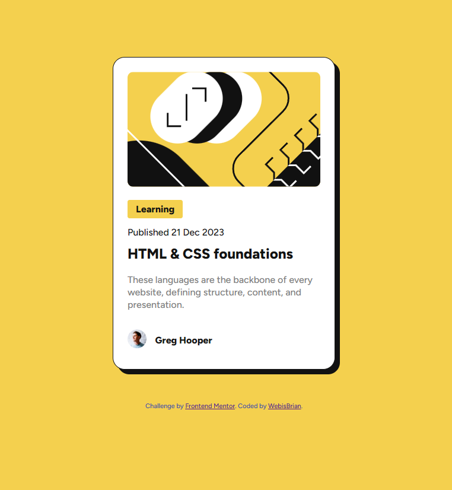

# Frontend Mentor - Blog preview card solution

This is a solution to the [Blog preview card challenge on Frontend Mentor](https://www.frontendmentor.io/challenges/blog-preview-card-ckPaj01IcS). Frontend Mentor challenges help you improve your coding skills by building realistic projects. 

## Table of contents

- [Overview](#overview)
  - [The challenge](#the-challenge)
  - [Screenshot](#screenshot)
  - [Links](#links)
- [My process](#my-process)
  - [Built with](#built-with)
  - [What I learned](#what-i-learned)
  - [Continued development](#continued-development)
- [Author](#author)

## Overview

### The challenge

Users should be able to:

- See hover and focus states for all interactive elements on the page

### Screenshot

### Links

- Solution URL: [Add solution URL here](https://github.com/WebisBrian/WIB.blog-preview-card-main)

## My process

### Built with

- HTML
- CSS

### What I learned

Once again, I am proud to have achieved a project close to what was requested.
I learned to use Figma, superficially but it helped me with some margins/paddings.

### Continued development

I had a lot of trouble making the project responsive. I think I arrived at something pretty good, but with the help of what was happening around me. Media queries are therefore a priority.

For the rest, the automation is not yet there and I have been juggling a lot between Figma and VSC to gradually achieve this result.

I also didn't want to spend too much time looking for perfection, preferring to correct the main big mistakes.

## Author

- Frontend Mentor - [WebisBrian](https://www.frontendmentor.io/profile/WebisBrian)
